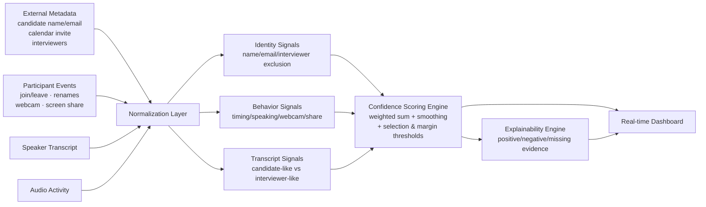

# Sherlock Candidate Identifier

**An AI-assisted real-time system that identifies the actual interview candidate among all meeting participants** — built for the Sherlock Internship Challenge.


## Problem

Sherlock detects fraud during live interviews on Google Meet, Microsoft Teams, and Zoom. Its fraud detectors (deepfake detection, voice cloning, behavioral analysis) must analyze the **candidate's** audio/video — not the interviewer's, not an observer's. But identifying which participant *is* the candidate is hard when metadata is imperfect:

- The candidate joins as `MacBook Pro`
- The candidate joins with a nickname (`Rohit K`)
- The recruiter typed the wrong candidate name
- Multiple interviewers are present, one of whom talks more than anyone
- Observers join silently with webcams off
- Candidate name or email is missing entirely
- Two participants look equally plausible

## Demo

```bash
npm install
npm run dev        # open http://localhost:3000
```

Pick a scenario, press **Play**, and watch the system update every participant's confidence after each meeting event — join, name change, webcam toggle, screen share, speech activity, and speaker-attributed transcript lines. The decision status moves through `Insufficient data → Uncertain → Selected` (or honestly stays `Uncertain`), and every score comes with human-readable evidence.

Also try:

```bash
npm test           # 54 unit tests for normalization, transcript analysis, scoring, scenarios
npm run evaluate   # prints the expected-vs-actual evaluation table for all 7 scenarios
npm run build      # production build
```

## Approach

The core thesis: **no single rule survives real meetings.** Display names lie, emails are often hidden, interviewers out-talk candidates, and metadata contains typos. So the system is a **multi-signal confidence engine** that combines nine weak signals per participant:

| Signal | Weight | What it captures |
|---|---:|---|
| Name match | 18% | Tiered comparison of display name (and name history) vs candidate name — exact, token, fuzzy/typo, initials, nickname |
| Transcript role | 18% | Deterministic classification of each utterance as candidate-like ("I built", "my final year") vs interviewer-like ("tell me about", "next question") |
| Interviewer exclusion | 16% | Identity match against known interviewer names/emails, host flag (soft penalty), question-asking behavior |
| Email match | 14% | Exact / local-part / domain-only matching when the platform exposes participant email |
| Speaking pattern | 14% | Answer-style turns vs question-style turns — *not* raw speaking duration, which favors interviewers |
| Join timing | 10% | Candidates join near the scheduled start; interviewers early; observers late |
| Webcam presence | 5% | Weak positive when on; only meaningfully negative when combined with silence |
| Screen share | 3% | Positive when sharing during a candidate-style technical discussion |
| Consistency | 2% | Rewards stable evidence and device-name → real-name renames; scores are temporally smoothed |

Missing information is **neutral (0.4), never zero** — a candidate without an exposed email must not be punished for the platform's limitation. Every signal emits evidence objects with direction, strength, and exact point impact, so the UI can show *why*.

## Architecture



See [docs/architecture.md](docs/architecture.md) for the full component walkthrough. The event engine and scoring engine live in `lib/` with zero UI dependencies — in production the same reducer would sit behind a WebSocket/Kafka consumer fed by a Meet/Zoom/Teams adapter instead of scenario JSON.

## Confidence Scoring

Each participant's raw score is the weighted sum of the nine signals (weights sum to 1.0, so the score is already 0–1). Two safeguards turn scores into decisions:

```
selected          ⇔ topScore ≥ 0.68  AND  (topScore − secondScore) ≥ 0.12
uncertain         ⇔ otherwise (after ≥ 3 events)
insufficient_data ⇔ fewer than 3 events processed
```

Scores are exponentially smoothed (`0.65 × previous + 0.35 × raw`) so one event never causes a wild jump — a real-time system that flip-flops is worse than one that converges.

## Handling Ambiguity

**A wrong confident identification is worse than an honest uncertain state.** When the top two participants are within 12 points (e.g. `Aman S` at 68% vs `A Singh` at 66%), the system returns *Candidate uncertain*, shows both sets of competing evidence, and says exactly what additional evidence would resolve the tie.


## Demo Scenarios

| # | Scenario | What it proves |
|---|---|---|
| 1 | Clear candidate match | Baseline: all signals agree → 87% confidence |
| 2 | Candidate joins as **MacBook Pro** | Transcript role + behavior identify a useless display name; mid-meeting rename rewarded |
| 3 | Nickname (`Rohit K`) | Token + initial matching, no exact name needed |
| 4 | Multiple interviewers + silent observer | The loudest speaker (interviewer) is *not* selected; silent observer penalized |
| 5 | Missing candidate name | Email local-part (`neha.verma`) + behavior recover the candidate; missing data stays neutral |
| 6 | Ambiguous twins | Correct abstention with competing evidence displayed |
| 7 | Wrong name in metadata (`Amit Shah` vs `Amit Sharma`) | Exact email match + behavior override the recruiter's typo |

## Setup Instructions

Requirements: Node.js 18+ (tested on Node 24), npm.

```bash
git clone https://github.com/Jay14090/sherlock-candidate-identifier.git
cd sherlock-candidate-identifier
npm install
npm run dev      # dashboard at http://localhost:3000
```

No API keys, no database, no external services — the app works fully offline after `npm install`.

## Running Tests

```bash
npm test         # vitest: 54 tests across 4 suites
npm run evaluate # scenario-level evaluation table
npm run build    # type-check + production build
npm run lint     # eslint
```

## Evaluation Summary

Measured output of `npm run evaluate` (see [docs/evaluation.md](docs/evaluation.md) for the full write-up):

| Scenario | Expected | System Result | Final Confidence | Margin | Status |
|---|---|---|---:|---:|---|
| clear-match | p2 | p2 | 0.87 | 0.64 | Selected |
| device-name | p2 | p2 | 0.73 | 0.32 | Selected |
| nickname | p2 | p2 | 0.72 | 0.49 | Selected |
| multiple-interviewers-observers | p2 | p2 | 0.80 | 0.40 | Selected |
| missing-metadata | p2 | p2 | 0.71 | 0.38 | Selected |
| ambiguous | abstain | abstained | 0.68 | 0.02 | Uncertain |
| wrong-name | p2 | p2 | 0.80 | 0.52 | Selected |

**7/7 expected outcomes, including correct abstention. Average confidence on correct selections: 0.77.** This validates reasoning behavior across representative edge cases; it is not a production benchmark.

## Assumptions

The prototype assumes access to participant-level metadata, speaker-attributed transcripts, and activity events (the challenge brief grants this). Events are simulated through local JSON but flow through the exact interfaces a real platform adapter would emit. Full list in [docs/assumptions.md](docs/assumptions.md).

## Limitations

Deterministic keyword transcript classification (can be gamed), hand-tuned weights, mock data only, no biometrics/diarization. Full honesty in [docs/limitations.md](docs/limitations.md), and the roads not taken in [docs/alternatives.md](docs/alternatives.md).

## Future Improvements

1. **Real platform adapters** — Meet/Zoom/Teams event ingestion over WebSocket, feeding the same reducer.
2. **LLM transcript role classifier** — the `TranscriptRoleClassifier` interface is already in place; an LLM with structured outputs would replace keyword matching for semantic robustness.
3. **Learned ranking model** — replace hand-tuned weights with a model trained on labeled historical interviews; calibrate thresholds on a validation set.
4. **Speaker diarization + audio embeddings** — voice-level continuity evidence.
5. **Consented visual signals** — face presence/liveness as *additional* evidence, never the sole identifier.
6. **Human-in-the-loop** — route low-confidence meetings to a reviewer; feed decisions back as training data.

---

*Built with Next.js 16, TypeScript, and Tailwind CSS. Demo walkthrough script in [docs/demo-script.md](docs/demo-script.md).*
