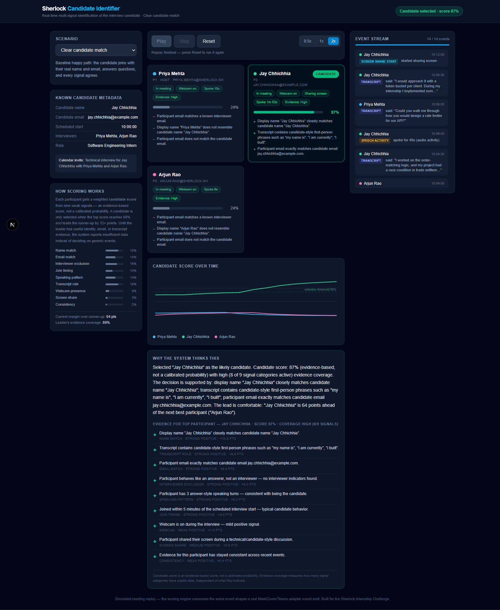
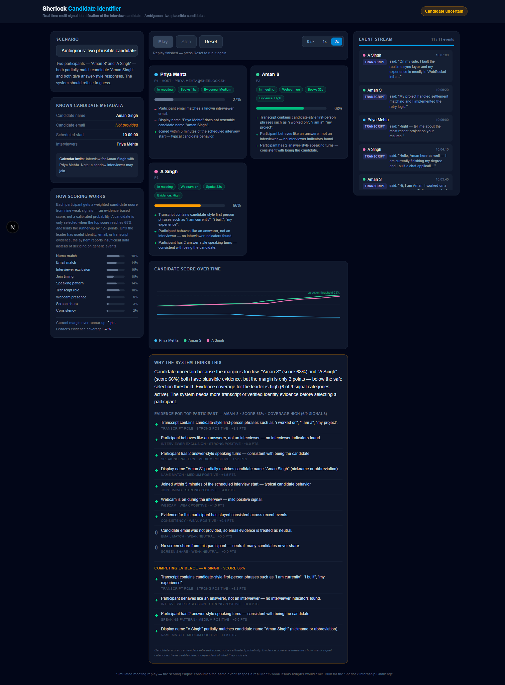
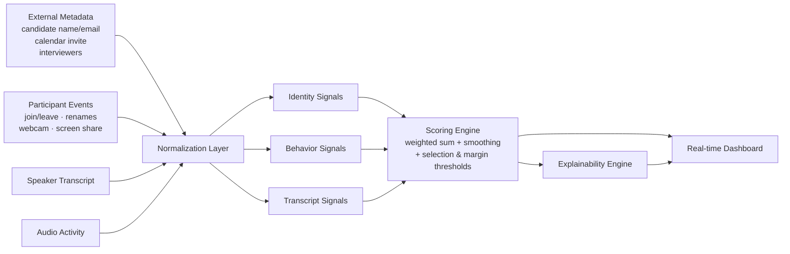

# Sherlock Candidate Identifier

**A production-minded decision-engine prototype for identifying the actual interview candidate in real time.** It combines multiple weak signals, updates continuously as meeting events arrive, explains its reasoning, and abstains instead of guessing when evidence is weak or ambiguous. The demo is synthetic and offline, but the architecture is adapter-ready for real meeting platforms.

**Live demo: https://jay14090.github.io/sherlock-candidate-identifier/**



## Problem

Sherlock detects fraud during live interviews on Google Meet, Microsoft Teams, and Zoom. Its fraud detectors (deepfake detection, voice cloning, behavioral analysis) must analyze the **candidate's** audio/video — not the interviewer's, not an observer's. But identifying which participant *is* the candidate is hard when metadata is imperfect:

- The candidate joins as `MacBook Pro`
- The candidate joins with a nickname (`Rohit K`)
- The recruiter typed the wrong candidate name
- Multiple interviewers are present, one of whom talks more than anyone
- Observers join silently with webcams off
- Candidate name or email is missing entirely
- Two participants look equally plausible

## Quick Start

```bash
git clone https://github.com/Jay14090/sherlock-candidate-identifier
cd sherlock-candidate-identifier
npm install
npm run dev
```

Open:

```txt
http://localhost:3000
```

Testing and evaluation:

```bash
npm test           # 61 unit tests: normalization, transcript analysis, scoring, scenarios
npm run evaluate   # expected-vs-actual table for all 7 scenarios
npm run build      # type-check + production build
```

No API keys, no database, no external services — everything runs offline after `npm install`.

Pick a scenario, press **Play**, and watch every participant's candidate score update after each meeting event. The decision moves through `Insufficient data → Uncertain → Selected` (or honestly stays `Uncertain`), and every score comes with human-readable evidence.

## Approach

The core thesis: **no single rule survives real meetings.** Display names lie, emails are often hidden, interviewers out-talk candidates, and metadata contains typos. So the system is a multi-signal engine that combines five signal families per participant:

| Signal family | Purpose |
|---|---|
| Identity | name, email, name-change history |
| Role behavior | transcript role classification, answer-vs-question speaking patterns |
| Meeting context | interviewer exclusion, join timing |
| Media behavior | webcam and screen-share state |
| Temporal consistency | stable evidence across time, smoothed scoring |

Two numbers are reported separately for every participant:

- **Candidate score** — how strongly the evidence points to this participant being the candidate. This is an *evidence-based score, not a calibrated probability*.
- **Evidence coverage** — how many of the nine signal categories actually have usable data, independent of what they indicate. A 70% score backed by high coverage means something different from a 70% score backed by two signals.

Missing information is neutral, never negative, and every signal emits evidence with its exact point impact so the UI can show *why*. Full weight tables, per-signal rules, and thresholds: [docs/scoring.md](docs/scoring.md).

## Decisions and Ambiguity

```
selected          ⇔ leader has useful evidence AND score ≥ 0.68 AND margin ≥ 0.12
uncertain         ⇔ otherwise
insufficient_data ⇔ no one joined, or the leader has only generic events
                    (joins/webcam toggles) behind their score
```

**A wrong confident identification is worse than an honest uncertain state** — it would poison every downstream fraud detector. When the top two participants are within 12 points (e.g. `Aman S` at 68% vs `A Singh` at 66%), the system reports *Candidate uncertain*, displays both sets of competing evidence, and names the evidence that would resolve the tie.



## Output Contract

Downstream consumers (Sherlock's fraud detectors) would receive this shape on every update — the demo's internal decision maps 1:1 onto it:

```ts
type CandidateIdentificationResult = {
  meetingId: string;
  selectedParticipantId: string | null;
  decision: "insufficient_data" | "uncertain" | "selected";
  candidateScore: number;        // evidence-based score, not a calibrated probability
  evidenceCoverage: number;      // 0..1 — how much usable evidence backs the leader
  marginToRunnerUp: number;
  runnerUpParticipantId: string | null;
  evidence: EvidenceItem[];      // per-signal, with direction/strength/point impact
  updatedAtEventId: string;
};
```

## Architecture



### Production shape

The same engine, in production, sits in this pipeline:

```
Platform bot / meeting adapter (Meet · Zoom · Teams)
  → normalized meeting-event stream
  → per-meeting reducer (lib/mockMeetingEngine.ts)
  → scoring engine (lib/scorer.ts)
  → candidate-identification updates (CandidateIdentificationResult)
  → downstream fraud detectors
  → audit/replay logs
```

The demo replays mock JSON events, but they flow through the exact event schema and pure reducer a real adapter would feed — swapping the JSON source for a WebSocket/Kafka consumer changes nothing in the engine. The immutable runtime state serializes cleanly, so meetings shard across workers and every historical decision can be replayed and re-explained for audits. Component walkthrough: [docs/architecture.md](docs/architecture.md).

## AI/ML Approach

The demo uses **deterministic transcript classification** for reproducibility, zero API keys, and stable evaluation — every run of `npm run evaluate` produces identical numbers, which makes regressions detectable and claims checkable.

The architecture exposes a `TranscriptRoleClassifier` interface, so a production deployment can replace the keyword classifier with an LLM, an embedding model, or a hybrid semantic classifier **without changing the scoring engine**. A drop-in example of an LLM-backed classifier (using structured outputs, invoked selectively for ambiguous utterances) is included at [`lib/transcriptAnalyzer.llm.example.ts`](lib/transcriptAnalyzer.llm.example.ts) — it is illustrative and not required to run the demo. The staged upgrade path (deterministic → embeddings → selective LLM → multilingual → calibration on labeled data) is in [docs/scoring.md](docs/scoring.md#transcript-classifier-roadmap).

## Demo Scenarios

| # | Scenario | What it proves |
|---|---|---|
| 1 | Clear candidate match | Baseline: all signals agree |
| 2 | Candidate joins as **MacBook Pro** | Transcript role + behavior overcome a useless display name; mid-meeting rename rewarded |
| 3 | Nickname (`Rohit K`) | Token + initial matching, no exact name needed |
| 4 | Multiple interviewers + silent observer | The loudest speaker (interviewer) is *not* selected; silent observer scores low |
| 5 | Missing candidate name | Email local-part (`neha.verma`) + behavior recover the candidate; missing data stays neutral |
| 6 | Ambiguous twins | Correct abstention with competing evidence displayed |
| 7 | Wrong name in metadata (`Amit Shah` vs `Amit Sharma`) | Exact email match + behavior override the recruiter's typo |

## Evaluation Summary

Measured output of `npm run evaluate` — deterministic, identical on every run:

| Scenario | Expected | System Result | Candidate score | Coverage | Margin | Status |
|---|---|---|---:|---:|---:|---|
| clear-match | p2 | p2 | 0.87 | 0.89 | 0.64 | Selected |
| device-name | p2 | p2 | 0.73 | 0.89 | 0.32 | Selected |
| nickname | p2 | p2 | 0.72 | 0.67 | 0.49 | Selected |
| multiple-interviewers-observers | p2 | p2 | 0.80 | 0.67 | 0.40 | Selected |
| missing-metadata | p2 | p2 | 0.71 | 0.67 | 0.38 | Selected |
| ambiguous | abstain | abstained | 0.68 | 0.67 | 0.02 | Uncertain |
| wrong-name | p2 | p2 | 0.80 | 0.78 | 0.52 | Selected |

**Synthetic scenario pass rate: 7/7**, including correct abstention on the ambiguous case. Average candidate score on correct selections: 0.77.

> This is controlled behavioral validation, not a real-world accuracy benchmark. The scenarios are synthetic and designed to test the failure modes described in the challenge. Full write-up, edge-case matrix, and evaluation limitations: [docs/evaluation.md](docs/evaluation.md).

## Assumptions

The prototype assumes access to participant-level metadata, speaker-attributed transcripts, and activity events (granted by the challenge brief). Events are simulated through local JSON but flow through the exact interfaces a real platform adapter would emit. Full list: [docs/assumptions.md](docs/assumptions.md).

## Limitations & Adversarial Cases

The evaluation should be interpreted as controlled behavioral validation, not a real-world benchmark. Transcript role classification is intentionally simple in the offline demo and should be replaced by a semantic classifier in production. Known adversarial cases that are **not fully solved** — malicious renames, two-device joins, mid-call person swaps, wrong speaker attribution — are documented honestly, with current mitigations, in [docs/limitations.md](docs/limitations.md#adversarial-cases-not-fully-solved). Rejected design alternatives and the reasoning: [docs/alternatives.md](docs/alternatives.md).

## Future Improvements

1. **Real platform adapters** — Meet/Zoom/Teams event ingestion over WebSocket, feeding the same reducer.
2. **Semantic transcript classification** — embeddings + selective LLM behind the existing interface ([roadmap](docs/scoring.md#transcript-classifier-roadmap)).
3. **Learned ranking model** — replace hand-tuned weights with a model trained on labeled historical interviews; calibrate the score into a real probability on a held-out set.
4. **Speaker diarization + audio embeddings** — voice-level continuity evidence; detects mid-call speaker swaps.
5. **Consented visual signals** — face presence/liveness as *additional* evidence, never the sole identifier.
6. **Human-in-the-loop** — route low-confidence meetings to a reviewer; feed decisions back as training data.

## Submission Checklist

- [x] GitHub repository — https://github.com/Jay14090/sherlock-candidate-identifier
- [x] Live demo — https://jay14090.github.io/sherlock-candidate-identifier/
- [x] README with setup instructions (this file)
- [x] Architecture diagram — above and [docs/architecture.md](docs/architecture.md)
- [x] Assumptions — [docs/assumptions.md](docs/assumptions.md)
- [x] Evaluation — [docs/evaluation.md](docs/evaluation.md) + `npm run evaluate`
- [x] Edge cases — [docs/evaluation.md](docs/evaluation.md#edge-cases-covered)
- [x] Limitations — [docs/limitations.md](docs/limitations.md)
- [x] Demo video script — [docs/demo-script.md](docs/demo-script.md)

---

*Build stats: ~3.5k lines across engine, UI, scenarios, tests, scripts, and documentation. Next.js 16 · TypeScript (strict) · Tailwind CSS v4 · Vitest.*
