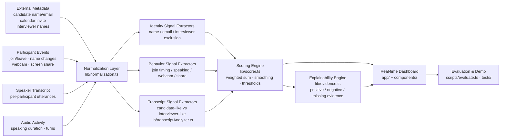

# Architecture

## System Diagram



## Components

### Event source — `data/*.json` + `lib/mockMeetingEngine.ts`

Meeting scenarios are JSON files containing metadata, a participant roster, and a chronological event stream (`join`, `leave`, `display_name_change`, `webcam_on/off`, `screen_share_start/stop`, `speech_activity`, `transcript`). The engine applies events one at a time through a **pure reducer** (`applyMeetingEvent`) that updates per-participant runtime state — current name, name history, join time, webcam state, speaking totals, analyzed utterances — then re-runs the full scoring engine and appends to a confidence history.

This is the production seam: replace the JSON replay with a WebSocket/Kafka consumer receiving real Meet/Zoom/Teams events and *nothing else changes*. The reducer and scorer are UI-free and side-effect-free.

### Normalization layer — `lib/normalization.ts`

- Unicode-aware name normalization (lowercase, punctuation strip, whitespace collapse)
- Device/placeholder-name detection (`MacBook Pro`, `Guest`, `User 2`, …)
- Tiered name comparison: exact → strong token overlap → fuzzy full-string (typos) → token + initial (nicknames like `Rohit K`) → shared token → weak. Each tier returns a score *and* a human-readable reason.
- Email local-part extraction and tokenization (`neha.verma` → `["neha","verma"]`), used both for direct email matching and as a fallback identity signal when the candidate name is missing or wrong.
- Small hand-rolled Levenshtein — names are short, so O(n·m) is irrelevant, and zero dependencies keeps the demo reproducible.

### Transcript analyzer — `lib/transcriptAnalyzer.ts`

Deterministic role classification: counts first-person experience phrases (candidate-like) vs question/instruction phrases (interviewer-like). Both likelihoods can be non-zero; a single matched phrase is capped so it can never dominate. The `TranscriptRoleClassifier` async interface wraps it so an LLM-backed classifier can be swapped in without touching the scorer.

Deterministic-first was a deliberate choice: reproducible tests, zero latency, zero cost, no API keys — and the demo's evaluation numbers mean something because they can't vary run to run.

The swap is not hypothetical: `lib/transcriptAnalyzer.llm.ts` implements the same interface with Claude (structured outputs), and the dashboard's **Classifier panel** lets a reviewer run it live with their own API key — the scenario's transcript events are re-classified semantically and the replay re-scores with the LLM analyses, falling back to the deterministic classifier on any error. The production cascade (deterministic → embeddings → selective LLM) is designed in [production-ingestion.md](production-ingestion.md#5-the-full-llm-in-production).

### Scoring engine — `lib/scorer.ts`

Per participant, computes nine signal scores (each 0–1 with neutral = 0.4), emits evidence for every signal, and combines them with fixed weights (sum = 1.0). Key design decisions:

- **Interviewer exclusion is expressed positively** (1.0 = definitely not an interviewer) so the weighted sum stays a simple dot product.
- **Missing data is neutral, never zero** — and the evidence says so explicitly ("Candidate email was not provided, so email evidence is treated as neutral").
- **Temporal smoothing** (`0.65 · prev + 0.35 · raw`) lives in the scoring path so scores converge instead of jumping.
- **Decision thresholds**: select only if the leader's score ≥ 0.68 *and* the margin over the runner-up ≥ 0.12. The system reports `insufficient_data` until the leader has *useful* evidence — at least one identity/email/transcript signal, or two distinct non-media signal categories. Generic events (joins, webcam toggles) never establish decidability, no matter how many there are. Only participants who actually joined are eligible.
- **Evidence coverage**: alongside the score, each participant reports how many of the nine signal categories have usable data — so consumers can distinguish a well-evidenced 70% from a thin one. Details in [scoring.md](scoring.md).

### Explainability engine — `lib/evidence.ts`

Every signal returns `EvidenceItem`s with direction (positive/negative/neutral), strength (weak/medium/strong), a message, and `weightImpact` — the exact contribution relative to a fully-neutral participant, in points. The decision explanation is assembled from the top positive evidence plus the margin, producing text like:

> Selected "Ananya S" as the likely candidate. Candidate score: 73% (evidence-based, not a calibrated probability) with high (8 of 9 signal categories active) evidence coverage. The decision is supported by: transcript contains candidate-style first-person phrases…; participant behaves like an answerer…. The lead is comfortable: "Ananya S" is 32 points ahead of the next best participant.

### Dashboard — `app/page.tsx` + `components/`

Client-side replay controls (play/pause/step/reset, 0.5×/1×/2× speed) drive the engine. Regions: scenario selector, candidate metadata panel, scoring-weights summary, participant cards (score bar, evidence-coverage badge, state chips, name history, top evidence), custom SVG score-over-time chart with the selection threshold line, full explanation panel with per-signal point impacts, and the raw event stream.

## Data Flow Per Event

1. Event arrives (replay tick or Step click).
2. Reducer updates that participant's runtime state (e.g. a `transcript` event stores the utterance *with its role analysis attached*).
3. Scorer recomputes all nine signals for **every** participant (an event about one participant changes relative context for others — e.g. meeting-wide silence thresholds).
4. Smoothed scores update, decision logic runs, score history appends.
5. UI re-renders from the single immutable runtime state object.

## Production Architecture

The demo replays mock JSON events, but the engine was designed adapter-first. The production pipeline:

```
Platform bot / meeting adapter (Meet · Zoom · Teams)
  → normalized meeting-event stream          (the MeetingEvent schema in lib/types.ts)
  → per-meeting reducer                      (applyMeetingEvent — pure, stateless between events)
  → scoring engine                           (scoreMeetingState — pure)
  → candidate-identification updates         (CandidateIdentificationResult, below)
  → downstream fraud detectors               (consume the selected participant's streams)
  → audit/replay logs                        (runtime state serializes; decisions replayable)
```

Swapping the JSON replay for a WebSocket/Kafka consumer changes nothing inside the reducer or scorer — they consume events one at a time with no knowledge of their origin.

### Output contract for downstream consumers

Every processed event yields an update in this shape (defined in `lib/types.ts`):

```ts
type CandidateIdentificationResult = {
  meetingId: string;
  selectedParticipantId: string | null;
  decision: "insufficient_data" | "uncertain" | "selected";
  candidateScore: number;        // evidence-based score, not a calibrated probability
  evidenceCoverage: number;      // 0..1 — how much usable evidence backs the leader
  marginToRunnerUp: number;
  runnerUpParticipantId: string | null;
  evidence: EvidenceItem[];
  updatedAtEventId: string;
};
```

Fraud detectors key off `selectedParticipantId` when `decision === "selected"`; an `uncertain` decision routes to human review or a hold state rather than analyzing the wrong participant's media. `evidence` and `updatedAtEventId` make every decision auditable after the fact.

## Scaling Notes

- Scoring is O(participants × signals) per event with tiny constants — comfortably real-time for meeting-sized rosters even at hundreds of events/minute.
- The engine is stateless between events except for the runtime state object, which serializes cleanly — so it can be sharded per-meeting across workers, checkpointed, and replayed for audits.
- Evidence objects double as an audit log: every historical decision can be reconstructed and explained after the fact.
